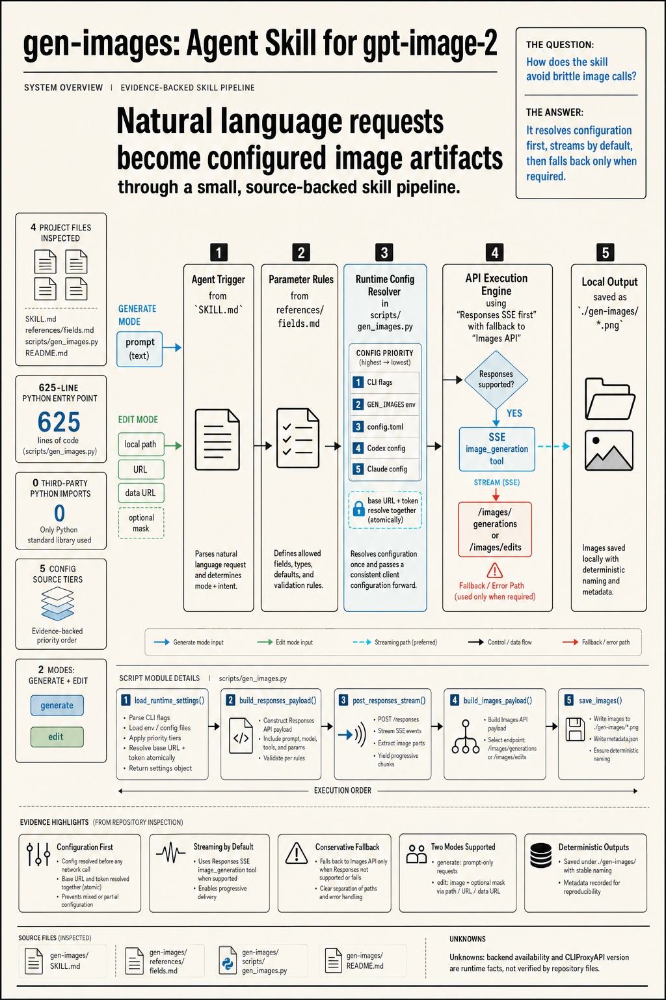

# figforge-gen

给 Codex / Claude Code 用的图片生成 / 改图 skill,适用于通过 CLIProxyAPI 调用 `gpt-image-2`。



## 功能

- 文生图 / 改图 / 编辑图片
- 默认 Responses API SSE 流式,降低长任务被代理 524 的概率;不支持时回退非流式 Images API
- 支持自动触发与 `/figforge-gen ...` 手动调用
- 优先读取 `figforge-gen` 独立 API 配置;没有时回退 Codex / Claude Code 配置
- 默认结果保存到 `<当前项目>/figforge-gen/`,可用 `--out-dir` 指定

## 来源与改动

基于 Linux.do 讨论帖整理改造:<https://linux.do/t/topic/2042175>

主要调整(目标:在 Codex / Claude Code / 任意可执行 Bash 的 Agent 环境中复用):

- 支持 Codex 配置读取(按当前 `model_provider` 动态读取 `base_url`,不再假设 provider 名为 `OpenAI`)
- 支持 `figforge-gen` 独立 API 配置,优先级高于 Codex / Claude Code
- 保留 Claude Code 配置作为最终回退
- Python 启动改为探测式选择,优先用本机 Python 3.11+,`uv` 仅作兜底
- 增加 LLM 参数整理规则(可保守推断 `size`、`quality`、`background`、`output_format`、`n`、`input_fidelity`)
- `--model` 支持自定义图片模型
- `--out-dir` 让 Agent 显式指定项目内输出目录
- 默认走 Responses API SSE 流式
- HTTP 请求补充 `Accept` / `User-Agent`,避免被部分反代拒绝

## 使用前提

- **CLIProxyAPI ≥ v6.9.34**
- **Python 3.11+**(脚本依赖 `tomllib`)

后端端点支持要求见 `references/api-config.md`。

## 安装

把整个 `figforge-gen` 目录复制到对应 Agent 的 skills 目录:

| Agent | 路径 |
|-------|------|
| Claude Code(用户级) | `~/.claude/skills/figforge-gen/` |
| Codex | 按 Codex 自身 skill 加载规则 |
| Windows Claude Code | `C:\Users\<用户名>\.claude\skills\figforge-gen\` |

复制后重启 Agent 或重载 skill。最终目录结构:

```text
figforge-gen/
├── SKILL.md
├── README.md
├── scripts/
│   ├── figforge_gen.py
│   └── choose_python.sh
├── references/
│   ├── fields.md
│   └── api-config.md
└── assets/
    └── architecture.png
```

## 配置

完整规则与原子性约束见 `references/api-config.md`。最简推荐:

`~/.config/figforge-gen/config.toml`:

```toml
[api]
base_url = "https://your-api-base/v1"
api_key_env = "FIGFORGE_GEN_API_KEY"
model = "gpt-image-2"
```

`~/.zshrc`(或对应 shell 配置):

```bash
export FIGFORGE_GEN_API_KEY="sk-..."
```

查看当前实际配置(不展示完整 token):

```bash
python3.12 scripts/figforge_gen.py --show-config
```

如果 key 写在 `~/.zshrc`,运行前需在同一 shell source:

```bash
zsh -lc 'source ~/.zshrc >/dev/null 2>&1 || true; python3.12 scripts/figforge_gen.py --show-config'
```

## 使用

### 通过 Skill 触发(自然语言或 `/figforge-gen`)

```text
使用 gpt-image-2 生成一张透明背景的猫咪头像
/figforge-gen 把 ./input.png 改成水彩风,保留主体,输出 webp
```

字段映射、推断规则、追问话术、timeout 规则全部由 `SKILL.md` + `references/fields.md` 控制。

### 直接 CLI 调用

> 直接调用脚本时,不会发生 LLM 参数推断;所有字段必须显式传。

```bash
python3.12 scripts/figforge_gen.py \
  --mode generate \
  --model pro/gpt-image-2 \
  --api-base https://your-api-base/v1 \
  --api-key-env FIGFORGE_GEN_API_KEY \
  --prompt "一张透明背景的猫咪头像" \
  --size 1024x1024 \
  --output-format png \
  --out-dir "./figforge-gen"
```

排查旧接口时显式关闭流式:

```bash
python3.12 scripts/figforge_gen.py --mode generate --no-stream --prompt "..." --size 1024x1024 --out-dir "./figforge-gen"
```

## 注意事项

1. `2160x3840` / `3840x2160` 在当前 `CLIProxyAPI + gpt-image-2` 链路实测可用,但不在 OpenAI 官方公开 size 枚举中,不保证所有后端一致支持
2. 流式可降低 524 风险但不能绝对避免;关键在反代链路要把 SSE 事件及时 flush
3. 复杂长 prompt 在超大尺寸下偶发失败时,先做最小提示词对照测试
4. `size`、`quality`、`output_format` 等生成参数**不要写入 API 配置文件**

## 文件

- `SKILL.md` — skill 主定义与触发规则
- `references/fields.md` — 字段、自然语言映射、LLM 推断、timeout 规则
- `references/api-config.md` — API 配置优先级、原子性、预检、后端端点
- `scripts/figforge_gen.py` — 接口调用脚本
- `scripts/choose_python.sh` — Python 3.11+ 探测器
